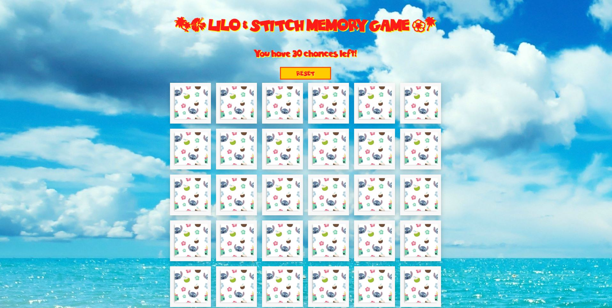

# Memory Game
This is my first project for Per Scholas.

Theme: Lilo & Stitch

## Description
This is a simple memory game where the player is given 30 attempts to match 15 sets of cards with the same images. If a player finds all cards, a winner's message will pop-up. If there are no more attempts left before finding all cards, a game-over message will pop-up.

## Images

## Tech Stack
    -Javascript
    -HTML
    -CSS

## Upcoming features

    -Level of difficulties
    -Count-down version
    -Background music & sound effects